# Conditional probability calculation audit / manager review

이 페이지는 **manager가 바로 검토할 최종 surface**다.
결론만 적지 않고, **conditional probability 계산 과정이 어떤 구조로 만들어졌고 → 어디까지 믿을 수 있고 → 아직 무엇이 production blocker인지**를 `single-axis matrix → pairwise winner map → coverage risk → audit path` 순서로 한 번에 보이게 묶었다.

## One-line manager answer
> **Use `wait_2d_close` as the current audited breakout baseline, but do not approve any context-specific override for production yet.**

## Executive conclusion
- window: `2025-04-01` → `2026-04-16`
- rows: `204,820` / events: `29,260`
- `promoted_bucket_count`: `0`
- exploratory buckets still visible: `28`
- manager reading: **conditional hypothesis map exists, production override does not.**

## Click-through proof map
- [entry-rule calculation audit (worked example: wait_2d_close)](/market-intel/research/wait-2d-close-review)
- [High Signal Entry Backtest Sample](/market-intel/research/high-signal-entry-backtest-sample)
- [prediction workspace](/market-intel/research/prediction-workspace)
- [2026-04-27_next-session-prep](/market-intel/daily/2026-04-27_next-session-prep)

## Review surface 1 — coverage risk first
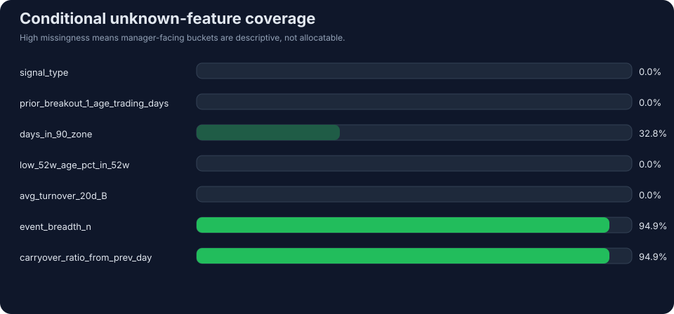

### Why this matters
- high missingness means some buckets are only **descriptive diagnostics**, not deployable context rules.
- especially `event_breadth_n` / `carryover_ratio_from_prev_day` should be treated as **coverage-gap monitors** until repair.

| axis | unknown events | total events | unknown rate |
| --- | ---: | ---: | ---: |
| `signal_type` | 0 | 29,260 | 0.0% |
| `prior_breakout_1_age_trading_days` | 0 | 29,260 | 0.0% |
| `days_in_90_zone` | 9,605 | 29,260 | 32.8% |
| `low_52w_age_pct_in_52w` | 0 | 29,260 | 0.0% |
| `avg_turnover_20d_B` | 0 | 29,260 | 0.0% |
| `event_breadth_n` | 27,762 | 29,260 | 94.9% |
| `carryover_ratio_from_prev_day` | 27,762 | 29,260 | 94.9% |

## Review surface 2 — single-axis winner board
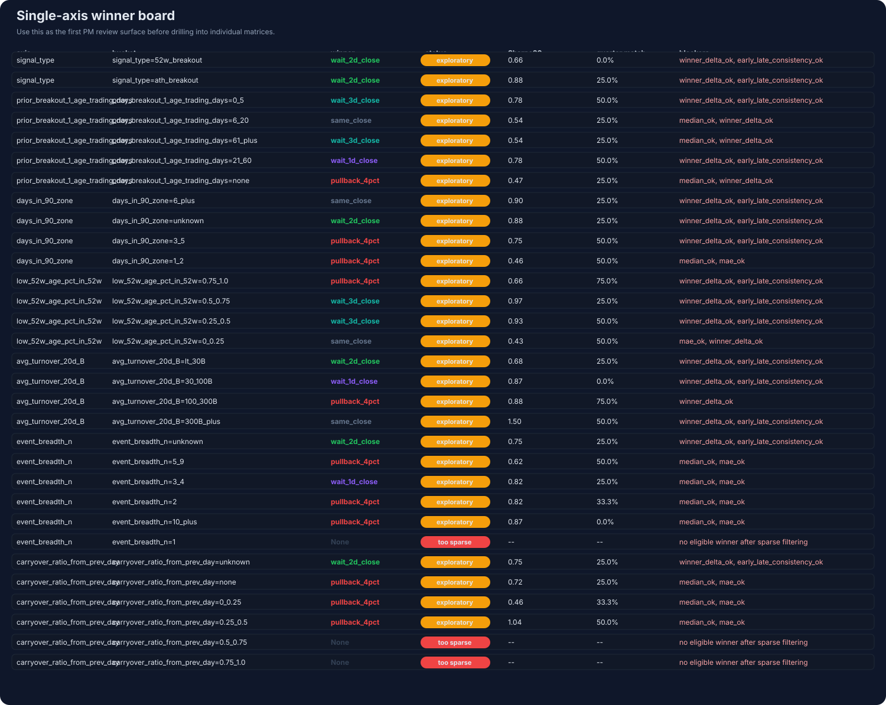

| axis | bucket | winner | Sharpe20 | status |
| --- | --- | --- | ---: | --- |
| `signal_type` | `signal_type=52w_breakout` | `wait_2d_close` | 0.66 | `exploratory` |
| `signal_type` | `signal_type=ath_breakout` | `wait_2d_close` | 0.88 | `exploratory` |
| `prior_breakout_1_age_trading_days` | `prior_breakout_1_age_trading_days=0_5` | `wait_3d_close` | 0.78 | `exploratory` |
| `prior_breakout_1_age_trading_days` | `prior_breakout_1_age_trading_days=6_20` | `same_close` | 0.54 | `exploratory` |
| `prior_breakout_1_age_trading_days` | `prior_breakout_1_age_trading_days=61_plus` | `wait_3d_close` | 0.54 | `exploratory` |
| `prior_breakout_1_age_trading_days` | `prior_breakout_1_age_trading_days=21_60` | `wait_1d_close` | 0.78 | `exploratory` |
| `prior_breakout_1_age_trading_days` | `prior_breakout_1_age_trading_days=none` | `pullback_4pct` | 0.47 | `exploratory` |
| `days_in_90_zone` | `days_in_90_zone=6_plus` | `same_close` | 0.90 | `exploratory` |
| `days_in_90_zone` | `days_in_90_zone=unknown` | `wait_2d_close` | 0.88 | `exploratory` |
| `days_in_90_zone` | `days_in_90_zone=3_5` | `pullback_4pct` | 0.75 | `exploratory` |
| `days_in_90_zone` | `days_in_90_zone=1_2` | `pullback_4pct` | 0.46 | `exploratory` |
| `low_52w_age_pct_in_52w` | `low_52w_age_pct_in_52w=0.75_1.0` | `pullback_4pct` | 0.66 | `exploratory` |
| `low_52w_age_pct_in_52w` | `low_52w_age_pct_in_52w=0.5_0.75` | `wait_3d_close` | 0.97 | `exploratory` |
| `low_52w_age_pct_in_52w` | `low_52w_age_pct_in_52w=0.25_0.5` | `wait_3d_close` | 0.93 | `exploratory` |
| `low_52w_age_pct_in_52w` | `low_52w_age_pct_in_52w=0_0.25` | `same_close` | 0.43 | `exploratory` |
| `avg_turnover_20d_B` | `avg_turnover_20d_B=lt_30B` | `wait_2d_close` | 0.68 | `exploratory` |
| `avg_turnover_20d_B` | `avg_turnover_20d_B=30_100B` | `wait_1d_close` | 0.87 | `exploratory` |
| `avg_turnover_20d_B` | `avg_turnover_20d_B=100_300B` | `pullback_4pct` | 0.88 | `exploratory` |
| `avg_turnover_20d_B` | `avg_turnover_20d_B=300B_plus` | `same_close` | 1.50 | `exploratory` |
| `event_breadth_n` | `event_breadth_n=unknown` | `wait_2d_close` | 0.75 | `exploratory` |
| `event_breadth_n` | `event_breadth_n=5_9` | `pullback_4pct` | 0.62 | `exploratory` |
| `event_breadth_n` | `event_breadth_n=3_4` | `wait_1d_close` | 0.82 | `exploratory` |
| `event_breadth_n` | `event_breadth_n=2` | `pullback_4pct` | 0.82 | `exploratory` |
| `event_breadth_n` | `event_breadth_n=10_plus` | `pullback_4pct` | 0.87 | `exploratory` |
| `event_breadth_n` | `event_breadth_n=1` | `--` | -- | `too_sparse` |
| `carryover_ratio_from_prev_day` | `carryover_ratio_from_prev_day=unknown` | `wait_2d_close` | 0.75 | `exploratory` |
| `carryover_ratio_from_prev_day` | `carryover_ratio_from_prev_day=none` | `pullback_4pct` | 0.72 | `exploratory` |
| `carryover_ratio_from_prev_day` | `carryover_ratio_from_prev_day=0_0.25` | `pullback_4pct` | 0.46 | `exploratory` |
| `carryover_ratio_from_prev_day` | `carryover_ratio_from_prev_day=0.25_0.5` | `pullback_4pct` | 1.04 | `exploratory` |
| `carryover_ratio_from_prev_day` | `carryover_ratio_from_prev_day=0.5_0.75` | `--` | -- | `too_sparse` |
| `carryover_ratio_from_prev_day` | `carryover_ratio_from_prev_day=0.75_1.0` | `--` | -- | `too_sparse` |

## Single-axis condition matrix
이 섹션은 **각 조건축별로 어떤 rule이 어디서 강한지**를 바로 보게 해준다.
각 셀은 `Sharpe20 / usable20`이고, 테두리 색은 `promoted / exploratory / too_sparse` 상태다.

### signal_type
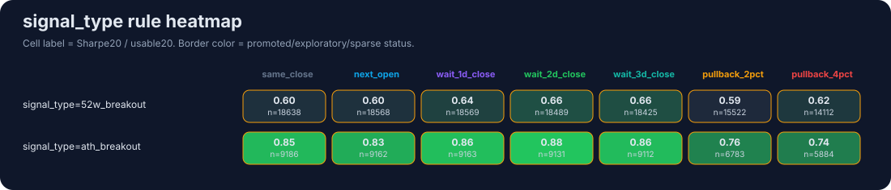

### prior_breakout_1_age_trading_days
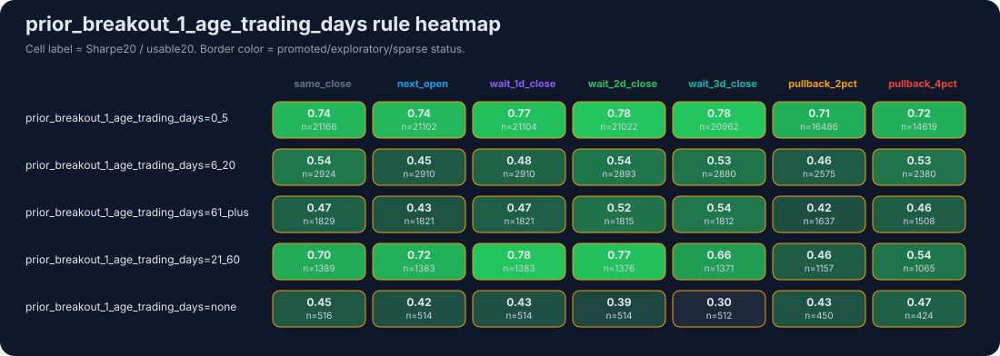

### days_in_90_zone
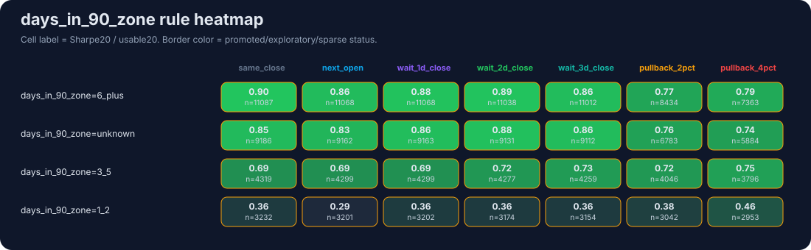

### low_52w_age_pct_in_52w
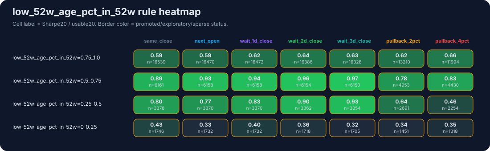

### avg_turnover_20d_B
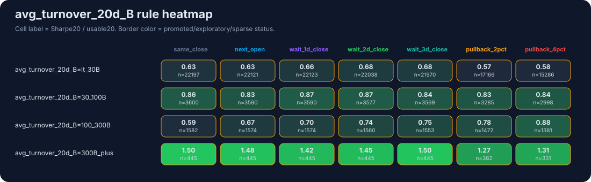

### event_breadth_n
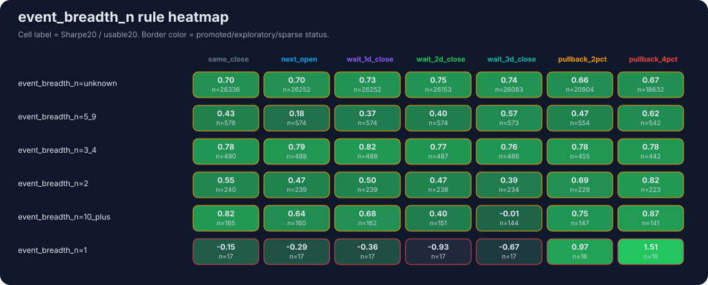

### carryover_ratio_from_prev_day
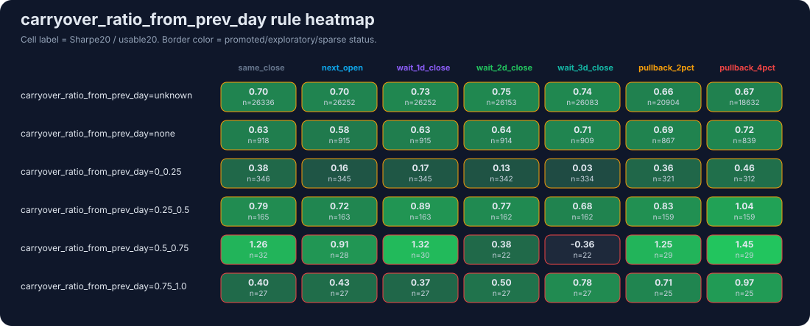

## Pairwise winner maps
이 섹션은 manager가 제일 궁금해하는 **regime switch**를 보여준다.
즉, `조건 A × 조건 B` 조합에서 pooled baseline을 실제로 뒤집는 winner가 있는지 본다.

### signal_type × prior_breakout_1_age_trading_days
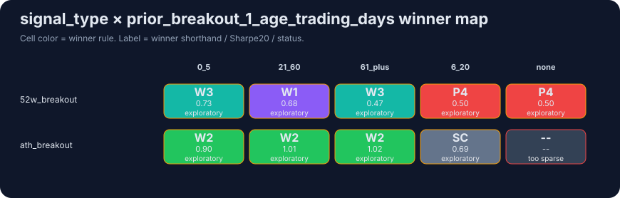

### signal_type × days_in_90_zone
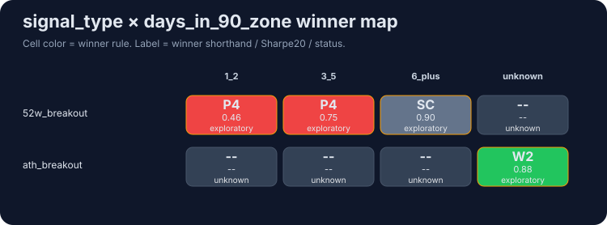

### days_in_90_zone × low_52w_age_pct_in_52w
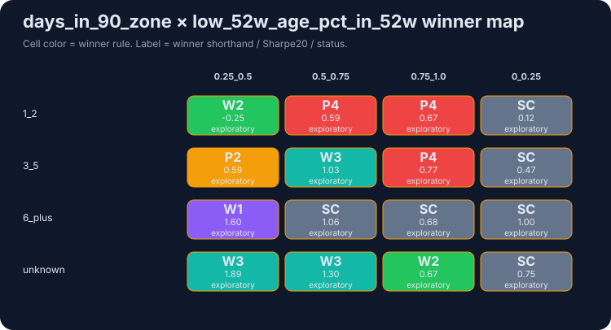

### avg_turnover_20d_B × prior_breakout_1_age_trading_days
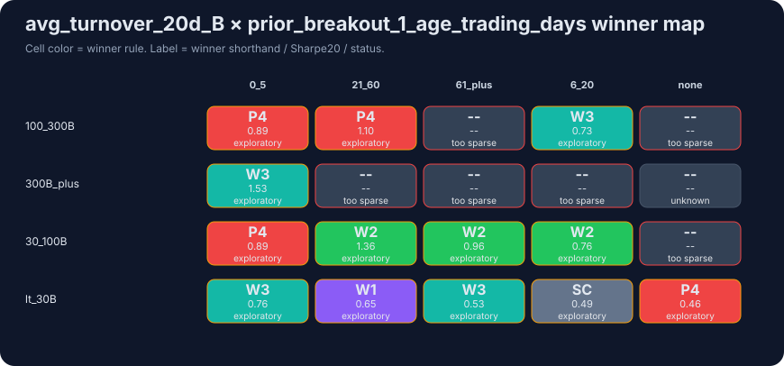

### event_breadth_n × carryover_ratio_from_prev_day
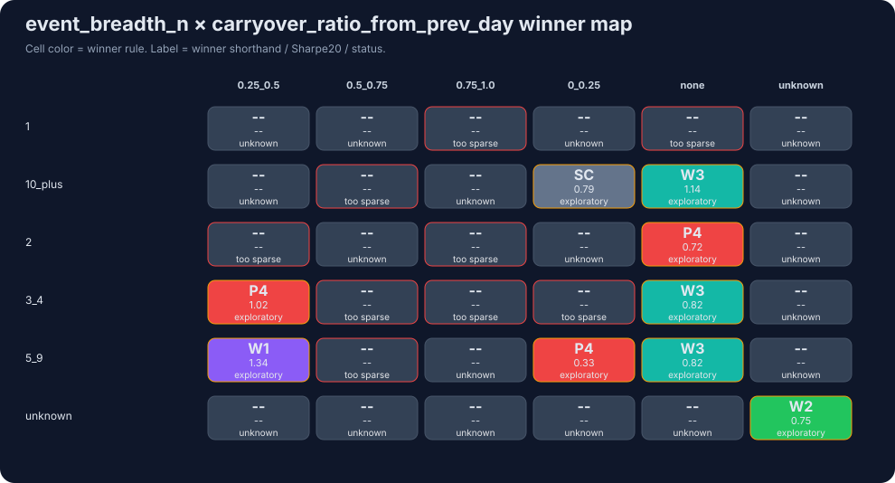

## Manager interpretation
- baseline answer는 있다: `wait_2d_close`.
- override answer는 아직 없다: promoted bucket이 거의 없거나, stability / coverage / delta gate에서 막힌다.
- 따라서 이 페이지는 **추천 페이지**라기보다 **승인/보류 판단 페이지**다.

## What is approved now
- audited default research baseline: `wait_2d_close`
- meaning: pooled breakout review에서 기본 비교축으로 쓰는 것은 허용

## What is not approved now
- `wait_2d_close`를 universal best rule로 표현하는 것
- pairwise bucket winner를 production override로 바로 승격하는 것
- high-missingness axes를 allocation rule로 사용하는 것

## Raw source paths
- repo json: `data/signals/high-signal-entry-outcomes/conditional-report-2025-04-01-to-2026-04-16.json`
- repo markdown: `docs/analysis/high-signal-conditional-report-2025-04-01-to-2026-04-16.md`
- experiment plan: `/Users/gbserver/repos/jmkr_kj/docs/plans/2026-04-26-high-signal-conditional-experiment-matrix.md`
- code: `scripts/build_high_signal_conditional_report.py`
- code: `scripts/render_high_signal_conditional_manager_surface.py`

## Reviewer drill-down
- canonical baseline audit note: [entry-rule calculation audit (worked example: wait_2d_close)](/market-intel/research/wait-2d-close-review)
- live workspace context: [prediction workspace](/market-intel/research/prediction-workspace)
- latest prep example: [2026-04-27_next-session-prep](/market-intel/daily/2026-04-27_next-session-prep)

