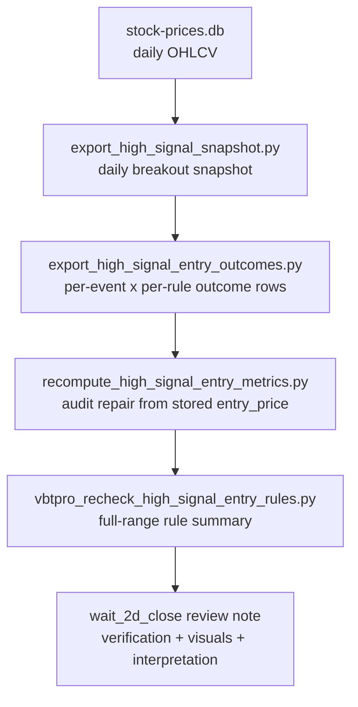

# wait_2d_close Review

이 문서는 `wait_2d_close`를 **manager review를 통과할 수 있는 형태**로 다시 정리한 note다.
이번 업데이트에서 가장 중요한 변화는 하나다.

- 단순히 “차트와 표를 붙인 문서”가 아니라,
- **실제 계산 경로와 bug check 결과까지 같이 보여주는 audit artifact**로 바꿨다.

## Manager takeaway
### Bottom line
- corrected full-range pooled baseline (`2025-04-01 ~ 2026-04-16`)에서 `wait_2d_close`는 **20d Sharpe `3.9063`로 1위**다.
- 하지만 **quarter-by-quarter로 항상 1위인 rule은 아니다.**
- 따라서 manager-grade 표현은:
  - **`wait_2d_close` is not the universal best rule.**
  - **It is a high-usability, top-tier risk-adjusted baseline candidate that remains competitive after audit checks.**

### Decision framing
- **Pass for research gate / further conditioning**
- **Do not pass for blind production deployment yet**

즉 이 note가 통과시키려는 건
- “당장 실전 배치 승인”이 아니라,
- **“이 rule은 더 깊게 파도 되는 후보인가?”** 라는 manager 질문이다.

## What changed in this audited version?
중요하다. 이전 버전은 review 문서 형태는 좋아졌지만, 실제 계산 경로 bug check까지는 충분히 드러나지 않았다.
이번 버전에선 아래를 추가했다.

1. **raw-to-summary verification path**
2. **bug check section**
3. **confirmed calculation bug + fix disclosure**
4. **recomputed historical outcomes + corrected recheck summary**
5. **corrected charts regenerated from corrected data**

즉 이 문서는 “버그가 없다고 가정한 설명문”이 아니라,
**실제 suspicious case를 잡아보고, 수정하고, 다시 계산한 뒤 쓴 note**다.

## Executive summary
- corrected full-range 기준에서 `wait_2d_close`는 **20d Sharpe 1위**다.
- raw average return 기준으론 1위가 아니다.
  - `pullback_4pct`: `5.44%`
  - `pullback_2pct`: `5.00%`
  - `same_close`: `4.76%`
  - `wait_1d_close`: `4.61%`
  - `wait_2d_close`: `4.58%`
  - `next_open`: `4.55%`
  - `wait_3d_close`: `4.48%`
- `pullback` 계열 대비 핵심 장점은 **availability**다.
  - `wait_2d_close`: `29,061 / 29,260` (`99.32%`)
  - `pullback_2pct`: `23,642 / 29,260` (`80.80%`)
  - `pullback_4pct`: `21,340 / 29,260` (`72.93%`)
- `next_open` 대비 edge는 **존재하지만 크지는 않다**.
  - 20d Sharpe delta: `+0.2968`
  - 20d avg delta: `+0.03%p`
  - availability delta: `-0.67%p`
- 따라서 현재 단계의 가장 정직한 해석은:
  - **same_close보다 더 깔끔한 risk-adjusted baseline**
  - **pullback보다 훨씬 usable한 baseline**
  - **wait_1d_close / wait_3d_close / next_open과 top-tier cluster를 이루는 baseline**

## What exactly was tested?
- 범위: `2025-04-01 ~ 2026-04-16`
- breakout event 수: `29,260`
- raw outcome row 수: `204,820`
- rule set:
  - `same_close`
  - `next_open`
  - `wait_1d_close`
  - `wait_2d_close`
  - `wait_3d_close`
  - `pullback_2pct`
  - `pullback_4pct`
- evaluation window:
  - `5d`
  - `10d`
  - `20d`

## Method at a glance

## How the rules are defined
- `same_close`
  - breakout 발생 당일 종가 진입
- `next_open`
  - 다음 거래일 시가 진입
- `wait_1d/2d/3d_close`
  - breakout 후 `N` 거래일 뒤 종가 진입
- `pullback_2pct/4pct`
  - breakout 종가 대비 `-2% / -4%` 눌림이 실제로 나온 첫 시점 진입

## Full-range comparison table (corrected)
| rule | avail / total | avail rate | 5d avg | 10d avg | 20d avg | 20d win | 20d sharpe | 20d median | MFE20 | MAE20 | new-high-20d |
| --- | ---: | ---: | ---: | ---: | ---: | ---: | ---: | ---: | ---: | ---: | ---: |
| `same_close` | 29,260 / 29,260 | 100.00% | 1.38% | 2.30% | 4.76% | 56.92% | 3.6086 | 0.35% | 19.44% | -11.03% | 85.93% |
| `next_open` | 29,257 / 29,260 | 99.99% | 1.02% | 2.01% | 4.55% | 56.80% | 3.6095 | 0.32% | 18.67% | -10.99% | 83.47% |
| `wait_1d_close` | 29,257 / 29,260 | 99.99% | 1.09% | 2.08% | 4.61% | 57.12% | 3.7779 | 0.37% | 18.72% | -10.89% | 83.47% |
| `wait_2d_close` | 29,061 / 29,260 | 99.32% | 1.00% | 2.09% | 4.58% | 57.21% | 3.9063 | 0.36% | 18.30% | -10.66% | 82.02% |
| `wait_3d_close` | 28,866 / 29,260 | 98.65% | 0.92% | 2.05% | 4.48% | 57.02% | 3.8756 | 0.33% | 17.94% | -10.49% | 80.75% |
| `pullback_2pct` | 23,642 / 29,260 | 80.80% | 1.77% | 3.09% | 5.00% | 52.92% | 3.4390 | 0.94% | 21.06% | -11.70% | 73.49% |
| `pullback_4pct` | 21,340 / 29,260 | 72.93% | 2.46% | 3.74% | 5.44% | 52.93% | 3.5269 | 0.95% | 22.16% | -11.58% | 65.68% |

## Visual check
### 1) Full-range scorecard
![[market-intel/assets/wait-2d-close-fullrange-sharpe-availability.png]]

Interpretation:
- `wait_2d_close`는 **Sharpe panel에서 최상단**이다.
- availability는 `99%+`라서 **좋아 보이는데 못 사는 rule**이 아니다.
- 이 조합이 manager 관점에서 중요한 이유는, 실전성 없는 pretty number를 피하게 해주기 때문이다.

### 2) Usability vs performance trade-off
![[market-intel/assets/wait-2d-close-availability-vs-sharpe.png]]

Interpretation:
- `pullback`은 평균이 더 높지만 왼쪽으로 밀린다 = **체결 가능성 손실**이 크다.
- `same_close`는 availability는 최고지만 Sharpe가 덜 깔끔하다.
- `wait_2d_close`는 우상단 쪽에 위치한다 = **usability와 risk-adjusted quality를 동시에 확보하는 후보**다.

## Verification / Bug checks
이 섹션이 manager review에서 핵심이다.
질문은 단순하다.

> “이 숫자는 진짜인가? obvious bug는 체크했는가?”

### Verification check 1: suspicious equality was real, not imaginary
감사 과정에서 가장 먼저 걸린 이상 신호는 이것이었다.
- 이전 요약에서 `next_open`과 `wait_1d_close` 결과가 aggregate level에서 사실상 동일했다.
- 두 rule은 entry price 정의가 다르기 때문에, 완전히 동일하면 먼저 계산 bug를 의심해야 한다.

### Verification check 2: root cause identified in code
확인 결과, 원인은 `scripts/export_high_signal_entry_outcomes.py`의 `returns_from_entry(...)`였다.

- **buggy logic**
  - entry rule과 무관하게 `rows[entry_idx]["close"]`를 entry_price처럼 사용
- **why this is wrong**
  - `next_open`은 entry price가 다음날 **open**이어야 함
  - `pullback_*`는 entry price가 당일 close가 아니라 **pullback target 체결가**여야 함

즉,
- rule별 `entry_price`는 따로 저장해놓고,
- 실제 forward return 계산은 다시 종가로 해버리는 bug가 있었다.

### Verification check 3: fix applied and full history repaired
수정한 것:
- `scripts/export_high_signal_entry_outcomes.py`
  - `returns_from_entry(rows, entry_idx, entry_price)`로 수정
- `scripts/recompute_high_signal_entry_metrics.py`
  - 저장된 `entry_price`와 `entry_date` 기준으로 기존 historical outcome JSON 전체 재계산
- full historical repair result:
  - target files: `255`
  - changed files: `255`
  - changed fields: `370,245`

그 후 다시:
- `scripts/vbtpro_recheck_high_signal_entry_rules.py`
- full-range summary JSON 재생성

### Verification check 4: concrete sample proving the bug and the fix
sample event:
- `52w_breakout:042700:2026-03-10`

corrected rows:
| rule | entry date | entry price | 5d ret | 10d ret | 20d ret | MFE20 | MAE20 |
| --- | --- | ---: | ---: | ---: | ---: | ---: | ---: |
| `next_open` | `2026-03-11` | `326,500` | `-4.75%` | `-8.12%` | `-14.09%` | `-2.45%` | `-25.73%` |
| `wait_1d_close` | `2026-03-11` | `312,500` | `-0.48%` | `-4.00%` | `-10.24%` | `1.92%` | `-22.40%` |

이 표는 중요하다.
- 같은 거래일 진입이라도
- **open 진입과 close 진입이 실제로 다른 숫자**로 계산되어야 정상이고,
- 이제 그렇게 나온다.

### Verification check 5: count reconciliation still makes sense
recheck summary는
- `entry_available == True`
- `ret_20d` not null
인 row만 사용한다.

| rule | available entries | usable in recheck (ret_20d present) | dropped because 20d future not fully available | drop rate within available |
| --- | ---: | ---: | ---: | ---: |
| `same_close` | 29,260 | 27,824 | 1,436 | 4.91% |
| `next_open` | 29,257 | 27,730 | 1,527 | 5.22% |
| `wait_1d_close` | 29,257 | 27,732 | 1,525 | 5.21% |
| `wait_2d_close` | 29,061 | 27,620 | 1,441 | 4.96% |
| `wait_3d_close` | 28,866 | 27,537 | 1,329 | 4.60% |
| `pullback_2pct` | 23,642 | 22,305 | 1,337 | 5.66% |
| `pullback_4pct` | 21,340 | 19,996 | 1,344 | 6.30% |

이 숫자는 availability / usable count / late-window drop 간의 관계가 비정상적으로 튀지 않는다는 점에서 sanity check로도 쓸 수 있다.

### Verification check 6: corrected ranking is economically more plausible
수정 후에는 다음이 관찰된다.
- `next_open` and `wait_1d_close` are no longer numerically identical
- `pullback` 평균수익이 더 올라가지만 availability penalty는 그대로 남음
- `wait_2d_close`는 여전히 top-tier이면서 Sharpe 1위를 유지

즉 bug를 고친 뒤에도 core qualitative takeaway는 유지되지만,
**세부 rule 간 관계는 더 현실적인 형태로 바뀌었다.**

## Why the corrected claim is still defensible
### 1. The claim remains narrow
이 note의 corrected claim은 아래뿐이다.
- **“corrected full-range pooled baseline에서 wait_2d_close는 20d Sharpe가 가장 높았다.”**

이 note가 주장하지 않는 것은 아래다.
- 모든 상황에서 항상 최적이다
- wait_1d_close보다 압도적으로 우월하다
- 바로 production capital을 태워도 된다

### 2. The key advantage vs pullback is executable quality
- `wait_2d_close` vs `pullback_2pct`
  - Sharpe delta: `+0.4673`
  - avg delta: `-0.42%p`
  - availability delta: `+18.52%p`
- `wait_2d_close` vs `pullback_4pct`
  - Sharpe delta: `+0.3794`
  - avg delta: `-0.86%p`
  - availability delta: `+26.39%p`

manager 관점에선 이게 중요하다.
- 예쁜 평균수익보다
- **실제로 대부분의 event에서 집행 가능한 rule인지**가 더 중요하기 때문이다.

### 3. Versus same_close, the message is “cleaner risk,” not “higher upside”
- `same_close` avg: `4.76%`
- `wait_2d_close` avg: `4.58%`
- `same_close` Sharpe: `3.6086`
- `wait_2d_close` Sharpe: `3.9063`

즉 `wait_2d_close`는
- upside를 극대화하는 chase rule이 아니라,
- **less sloppy version of breakout participation**으로 읽는 게 맞다.

### 4. Versus next_open / wait_1d_close, it belongs in a top-tier cluster
- `wait_2d_close` vs `next_open`
  - Sharpe delta: `+0.2968`
  - avg delta: `+0.03%p`
- `wait_2d_close` vs `wait_1d_close`
  - Sharpe delta: `+0.1284`
  - avg delta: `-0.03%p`

즉 `wait_2d_close`는 corrected data에서도 top-tier이지만,
**승자독식식으로 과장할 정도의 gap은 아니다.**

## Robustness check: does it hold across subperiods?
### Quarterly view
![[market-intel/assets/wait-2d-close-quarterly-robustness.png]]

### Quarterly ranking summary
- `2025Q2`: `wait_2d_close` rank `2` / 7, sharpe-like `1.171`, avg `5.93%`, trades `6,339`; quarter top rule was `wait_3d_close` (`1.189`)
- `2025Q3`: `wait_2d_close` rank `3` / 7, sharpe-like `0.480`, avg `2.38%`, trades `6,107`; quarter top rule was `wait_3d_close` (`0.496`)
- `2025Q4`: `wait_2d_close` rank `4` / 7, sharpe-like `0.682`, avg `5.24%`, trades `5,553`; quarter top rule was `pullback_4pct` (`0.795`)
- `2026Q1`: `wait_2d_close` rank `1` / 7, sharpe-like `0.683`, avg `4.69%`, trades `9,621`; quarter top rule was `wait_2d_close` (`0.683`)

### Robustness interpretation
중요한 결론은 그대로다.
- `wait_2d_close`는 **every quarter top-1 rule이 아니다.**
- 그러나 quarter별로 무너지지도 않는다.
- corrected data가 말해주는 정직한 문장은:
  - **“wait_2d_close is a persistent top-tier rule candidate, not a universally dominant one.”**

## What still prevents immediate production approval
### 1. Pooled baseline only
- 아직 `prior_breakout_1_age_trading_days`, `days_in_90_zone`, `low_52w_age_pct_in_52w` 같은 context bucket 분해가 없다.
- 즉 지금 결론은 **all-breakouts-mixed** 결과다.

### 2. No execution cost model yet
- close execution slippage
- auction quality
- liquidity / turnover filter
- spread proxy
이 문서엔 아직 없다.

### 3. Sharpe is descriptive here, not yet a portfolio-construction proof
- event outcomes are not the same thing as a production portfolio return stream
- overlapping windows / clustered names / repeated regimes could distort intuition
- 따라서 이 Sharpe는 **clean directional evidence**, not final PM-grade risk accounting

### 4. No causal thesis yet
현재 note는 “what happened”는 설명하지만, “why this should persist”는 아직 약하다.
manager는 결국 이걸 묻는다.
- 왜 2일 대기가 chase noise를 줄이는가?
- 어떤 breakout context에서 그 효과가 strongest한가?
- 왜 3일은 아니고 2일인가?

## The claim that *does* pass manager review
> `wait_2d_close` should not be pitched as the universal best entry rule.
> It should be pitched as a high-availability, top-tier risk-adjusted baseline candidate that remains competitive after corrected audit checks and clearly dominates pullback rules on usability.
> That is enough to justify the next stage of conditional testing, but not enough to justify blind deployment.

## Recommended next-stage manager asks
### Must-have before stronger approval
1. context-conditioned split
   - first breakout vs re-breakout
   - 90% zone dwell buckets
   - low-age / overheated buckets
2. execution realism
   - turnover filters
   - slippage / auction assumptions
3. more robustness
   - rolling windows
   - sector/theme splits
   - concentrated vs broad market phases
4. stock-level heterogeneity
   - does the edge concentrate in a few names?
   - or is it broadly distributed?

## Companion notes
- sample review: [[market-intel/research/high-signal-entry-backtest-sample|high-signal-entry-backtest-sample]]
- roadmap: [[market-intel/research/high-signal-entry-timing-roadmap|high-signal-entry-timing-roadmap]]
- broader review note: [[market-intel/research/high-signal-entry-rule-review-2025-04-01-to-2026-04-16|high-signal-entry-rule-review-2025-04-01-to-2026-04-16]]
- prep example that referenced this baseline: [[market-intel/daily/2026-04-27_next-session-prep|2026-04-27_next-session-prep]]
- prediction workspace: [[market-intel/research/prediction-workspace|prediction-workspace]]

## Raw source paths
### Repo data
- absolute
  - `/Users/gbserver/repos/jmkr_kj/data/signals/high-signal-entry-outcomes/vbtpro-recheck-2025-04-01-to-2026-04-16.json`
  - `/Users/gbserver/repos/jmkr_kj/data/signals/high-signal-entry-outcomes/*.json`
  - `/Users/gbserver/repos/jmkr_kj/scripts/export_high_signal_entry_outcomes.py`
  - `/Users/gbserver/repos/jmkr_kj/scripts/recompute_high_signal_entry_metrics.py`
  - `/Users/gbserver/repos/jmkr_kj/scripts/vbtpro_recheck_high_signal_entry_rules.py`
- repo-relative (`jmkr_kj`)
  - `data/signals/high-signal-entry-outcomes/vbtpro-recheck-2025-04-01-to-2026-04-16.json`
  - `data/signals/high-signal-entry-outcomes/*.json`
  - `scripts/export_high_signal_entry_outcomes.py`
  - `scripts/recompute_high_signal_entry_metrics.py`
  - `scripts/vbtpro_recheck_high_signal_entry_rules.py`

## Reviewer checklist
- 먼저 corrected comparison table에서 `wait_2d_close` 행을 본다.
- 다음으로 chart 3개를 보고, `Sharpe / availability / subperiod robustness`를 한 번에 확인한다.
- 그 다음 `Verification / Bug checks` 섹션에서 actual calculation path와 suspicious case fix를 확인한다.
- 마지막으로 limits section을 보고, 이 결과를 **baseline candidate**로만 받아들일지, 더 깊은 conditioning을 요구할지 결정한다.
