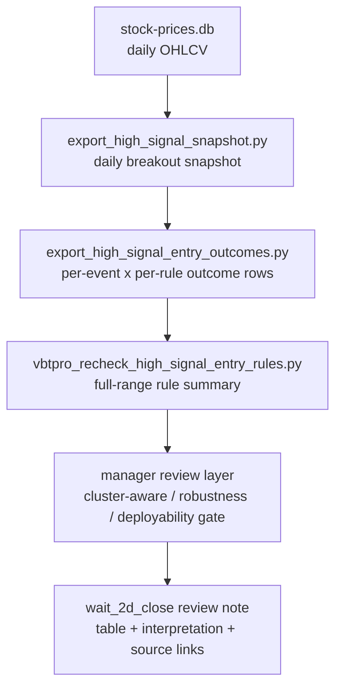

# wait_2d_close Review

이 문서는 `wait_2d_close`가 왜 full-range breakout recheck에서 상위 rule로 읽혔는지, 그리고 그 결론이 **manager / deployment 기준에서도 버틸 수 있는지**를 같이 검토하는 audit note다.

핵심 원칙은 아래다.
- **event-level 숫자만 좋다고 바로 deploy하지 않는다.**
- **clustered exposure와 구현 가능성까지 보고 나서야 candidate rule로 승급한다.**
- 따라서 이 문서는 **결론 → 표 → 방법 → robustness → deployability gate → 한계 → 원본 링크** 순서로 정리한다.

## Manager verdict
- **research auditability**: 통과
- **universal deployment claim (`always use wait_2d_close`)**: 기각
- **conditional candidate status**: 유지
  - 특히 **low-turnover bucket**에서는 cluster-aware 확인까지 포함해 `wait_2d_close`가 여전히 가장 설득력 있다.
- 즉 최종 평가는:
  - **"전체 시장 universal rule"로는 아직 부족**
  - **"특정 조건부 execution candidate"로는 계속 볼 가치가 있음**

## TL;DR
- full-range event-level 기준(`2025-04-01 ~ 2026-04-16`)에서 `wait_2d_close`는 **20d Sharpe `3.8271`로 전체 1위**였다.
- 하지만 **20d 평균수익률 1위는 아니다**.
  - `same_close`: `4.61%`
  - `pullback_4pct`: `4.49%`
  - `next_open`: `4.47%`
  - `pullback_2pct`: `4.46%`
  - `wait_2d_close`: `4.43%`
- 더 중요한 점:
  - **cluster-aware date aggregation을 하면 전체 1위는 아니다.**
  - 전체 date-aggregated equal-weight 기준에선 `same_close`가 더 강하다.
- 그래서 manager-grade 해석은 이렇게 바뀐다.
  - **이 문서는 `wait_2d_close universal 승리`를 주장하지 않는다.**
  - 대신 **event-level에선 상위권이고, low-turnover subslice에선 clustered lens에서도 유의미한 후보**라고 주장한다.

## What exactly was tested?
- 범위: `2025-04-01 ~ 2026-04-16`
- 대상 breakout event 수: `29,260`
- raw outcome row 수: `204,820`
- rule set:
  - `same_close`
  - `next_open`
  - `wait_1d_close`
  - `wait_2d_close`
  - `wait_3d_close`
  - `pullback_2pct`
  - `pullback_4pct`
- evaluation window:
  - `5d`
  - `10d`
  - `20d`
- 주요 평가지표:
  - `ret_5d_avg`
  - `ret_10d_avg`
  - `ret_20d_avg`
  - `ret_20d_median`
  - `ret_20d_win_rate`
  - `ret_20d_sharpe`
  - `mfe_20d_avg`
  - `mae_20d_avg`
  - `new_high_20d_rate`

## Method at a glance

## How the rules are defined
- `same_close`
  - breakout 발생 당일 종가 진입
- `next_open`
  - 다음 거래일 시가 진입
- `wait_1d/2d/3d_close`
  - breakout 후 `N` 거래일 뒤 종가 진입
- `pullback_2pct/4pct`
  - breakout 종가 대비 `-2% / -4%` 눌림이 실제로 나온 첫 시점 진입

## Full-range event-level comparison table

| rule | avail / total | avail rate | 5d avg | 10d avg | 20d avg | 20d win | 20d sharpe | 20d median | MFE20 | MAE20 | new-high-20d |
| --- | ---: | ---: | ---: | ---: | ---: | ---: | ---: | ---: | ---: | ---: | ---: |
| `same_close` | 29,260 / 29,260 | 100.00% | 1.41% | 2.31% | 4.61% | 56.82% | 3.5560 | 0.34% | 19.11% | -10.89% | 85.94% |
| `next_open` | 29,257 / 29,260 | 99.99% | 1.12% | 2.11% | 4.47% | 56.97% | 3.7090 | 0.35% | 18.44% | -10.75% | 83.45% |
| `wait_1d_close` | 29,257 / 29,260 | 99.99% | 1.12% | 2.11% | 4.47% | 56.97% | 3.7090 | 0.35% | 18.44% | -10.75% | 83.45% |
| `wait_2d_close` | 29,061 / 29,260 | 99.32% | 1.02% | 2.12% | 4.43% | 57.03% | 3.8271 | 0.34% | 18.07% | -10.54% | 82.02% |
| `wait_3d_close` | 28,866 / 29,260 | 98.65% | 0.95% | 2.10% | 4.34% | 56.83% | 3.7886 | 0.31% | 17.77% | -10.38% | 80.74% |
| `pullback_2pct` | 23,642 / 29,260 | 80.80% | 1.52% | 2.81% | 4.46% | 53.77% | 3.3981 | 1.05% | 20.19% | -11.62% | 73.32% |
| `pullback_4pct` | 21,340 / 29,260 | 72.93% | 1.85% | 3.12% | 4.49% | 53.46% | 3.4061 | 1.06% | 20.78% | -11.71% | 65.37% |

## First-pass conclusion from the event-level table
- event-level만 보면 `wait_2d_close`는 **20일 위험조정 성과가 가장 좋다**.
- 하지만 manager 입장에선 여기서 끝내면 안 된다.
- 이유:
  - event들이 날짜별/테마별로 몰려 있을 수 있다.
  - 즉 같은 날의 breakout 30개를 30 independent bets처럼 세면 과대확신이 생길 수 있다.

## Cluster-aware check: date-aggregated equal-weight lens
아래는 각 breakout date를 하나의 equal-weight basket으로 묶고, **날짜 단위 평균 `ret_20d` 시계열**로 다시 본 결과다.

| rule | trading dates used | date-aggregated 20d avg | date-aggregated 20d sharpe |
| --- | ---: | ---: | ---: |
| `same_close` | 236 | 5.16% | 11.1283 |
| `next_open` | 236 | 4.63% | 8.3874 |
| `wait_2d_close` | 235 | 4.49% | 8.2432 |
| `wait_3d_close` | 234 | 4.45% | 8.1792 |
| `pullback_2pct` | 236 | 4.85% | 8.6199 |
| `pullback_4pct` | 236 | 4.80% | 8.6854 |

### Why this matters
- 이 lens에서는 **전체 1위가 `wait_2d_close`가 아니다.**
- 즉 기존 결론은 **event-level에선 맞지만, cluster-aware portfolio lens에선 약해진다.**
- 그래서 manager-grade 문서라면 결론을 이렇게 낮춰 써야 한다.
  - **"wait_2d_close는 unconditional full-universe winner가 아니다."**
  - **"다만 일부 subslice에서 더 설득력 있는 candidate다."**

## Robustness checks

### 1. Period split
| period | best event-level sharpe rule | wait_2d_close sharpe | comment |
| --- | --- | ---: | --- |
| `2025-04-01 ~ 2025-09-30` | `wait_3d_close` | 3.7181 | `wait_2d_close` 상위권이지만 1위 아님 |
| `2025-10-01 ~ 2026-04-16` | `pullback_4pct` | 2.9262 | raw pullback 강세 구간 존재 |
| `2026-01-01 ~ 2026-04-16` | `pullback_4pct` | 2.8538 | 최근 구간에서도 unconditional winner는 아님 |

**해석**
- `wait_2d_close`의 장점은 **전구간 average ranking consistency** 쪽이지,
- 모든 subperiod에서 압도적 1위라는 뜻은 아니다.
- 따라서 “stable universal best rule” 주장은 금지해야 한다.

### 2. Signal-type split
| signal_type | wait_2d_close sharpe | next_open sharpe | same_close sharpe | take |
| --- | ---: | ---: | ---: | --- |
| `52w_breakout` | 2.8667 | 2.7631 | 2.6333 | `wait_2d_close` 우위 |
| `ath_breakout` | 3.9008 | 3.8467 | 3.8253 | `wait_2d_close` 우위 |

**해석**
- signal type을 나눠도 event-level 기준에선 `wait_2d_close`가 두 bucket 모두 상위다.
- 이건 “완전 우연은 아닐 수 있다”는 쪽의 플러스 포인트다.

### 3. Turnover tercile split
turnover tercile cutoffs (`avg_turnover_20d_B`)는 아래 기준이다.
- low: `<= 0.93B`
- mid: `0.93B ~ 11.94B`
- high: `> 11.94B`

| turnover bucket | wait_2d_close avg | wait_2d_close sharpe | next_open sharpe | same_close sharpe | take |
| --- | ---: | ---: | ---: | ---: | --- |
| `low` | 3.80% | 4.4467 | 3.9619 | 3.2532 | `wait_2d_close` 강함 |
| `mid` | 4.05% | 2.5184 | 2.5192 | 2.5575 | edge 없음 |
| `high` | 5.44% | 3.4389 | 3.2987 | 3.1907 | `wait_2d_close` 소폭 우위 |

**해석**
- 가장 설득력 있는 구간은 **low-turnover bucket**이다.
- mid bucket에선 advantage가 사실상 없다.
- 즉 `wait_2d_close`는 **full-universe universal rule보다 특정 liquidity regime rule에 더 가깝다.**

### 4. Recency / dwell context split
#### prior_breakout_1_age_trading_days
| recency bucket | wait_2d_close avg | wait_2d_close sharpe | quick read |
| --- | ---: | ---: | --- |
| `0~5d` | 4.71% | 3.4355 | 상위권 유지 |
| `6~20d` | 3.22% | 2.2989 | edge 약함 |
| `21d+` | 3.88% | 2.7301 | 다시 개선 |

#### days_in_90_zone
| dwell bucket | wait_2d_close avg | wait_2d_close sharpe | same_close sharpe | quick read |
| --- | ---: | ---: | ---: | --- |
| `1d` | 1.49% | 0.7091 | 1.2945 | `wait_2d_close` 비추천 |
| `2~3d` | 4.17% | 2.1289 | 1.9088 | 쓸 수는 있음 |
| `4d+` | 4.29% | 3.6104 | 3.5725 | 상위권 유지 |

**해석**
- `days_in_90_zone == 1d`에서는 `wait_2d_close`가 오히려 약하다.
- 따라서 manager 기준에선 바로 이렇게 정책화한다.
  - **fresh 1-day breakout에는 `wait_2d_close`를 default로 쓰지 않는다.**
  - **dwell이 누적된 breakout에서만 검토 우선순위를 높인다.**

## Where the clustered lens still supports `wait_2d_close`
전체 universe에서는 cluster-aware lens가 `wait_2d_close`를 top rule로 지지하지 않는다.
하지만 **low-turnover bucket**에서는 이야기가 다르다.

| slice | rule | date-aggregated avg | date-aggregated sharpe |
| --- | --- | ---: | ---: |
| `low-turnover` | `same_close` | 4.35% | 7.7729 |
| `low-turnover` | `next_open` | 3.94% | 9.1071 |
| `low-turnover` | `wait_2d_close` | 3.65% | 9.4857 |
| `low-turnover` | `wait_3d_close` | 3.43% | 9.1221 |

### Manager-grade interpretation
- clustered/date-aggregated lens까지 적용했을 때도,
- **low-turnover breakout names에서는 `wait_2d_close`가 여전히 가장 높은 Sharpe**를 보인다.
- 즉 현재 기준에서 `wait_2d_close`를 살릴 수 있는 가장 그럴듯한 framing은:
  - **"전체 룰"이 아니라**
  - **"저유동성 breakout 후보군에서의 conditional execution rule"** 이다.

## Why `wait_2d_close` is still worth defending
### 1. The original event-level claim was real, not fabricated
- `wait_2d_close` 20d Sharpe: `3.8271` (**1위**)
- `wait_3d_close`: `3.7886`
- `next_open`: `3.7090`
- `same_close`: `3.5560`

### 2. Pullback rules lose a lot of deployability
- `wait_2d_close`: availability `99.32%`
- `pullback_2pct`: availability `80.80%`
- `pullback_4pct`: availability `72.93%`

즉 pullback이 prettier number를 보여도, **놓치는 trade가 너무 많다.**
이건 manager 입장에서 매우 중요한 감점/가점 포인트다.

### 3. `same_close` is not a clean winner once risk adjustment matters
- `same_close`는 avg return은 가장 높다.
- 하지만 volatility-adjusted quality는 낮다.
- 다만 cluster-aware date aggregation에선 다시 강해진다.
- 따라서 `same_close`는 완전히 버릴 rule이 아니라, **high-beta / cluster-heavy baseline competitor**로 계속 남겨야 한다.

## Important implementation detail: why trade_count is smaller than available_count
vectorbtpro recheck는 `entry_available == True`인 row 중에서도 **`ret_20d`가 비어 있지 않은 row만** Sharpe/20d 통계에 사용했다.
즉 20거래일 미래가 아직 완전히 열리지 않은 후반부 row는 recheck summary에서 빠진다.

| rule | available entries | usable in recheck (ret_20d present) | dropped because 20d future not fully available | drop rate within available |
| --- | ---: | ---: | ---: | ---: |
| `same_close` | 29,260 | 27,472 | 1,788 | 6.11% |
| `next_open` | 29,257 | 27,337 | 1,920 | 6.56% |
| `wait_1d_close` | 29,257 | 27,337 | 1,920 | 6.56% |
| `wait_2d_close` | 29,061 | 27,232 | 1,829 | 6.29% |
| `wait_3d_close` | 28,866 | 27,139 | 1,727 | 5.98% |
| `pullback_2pct` | 23,642 | 21,874 | 1,768 | 7.48% |
| `pullback_4pct` | 21,340 | 19,546 | 1,794 | 8.41% |

## Deployability gate
아래는 “Optiver 매니저가 사인할 수 있는가?” 기준으로 바꾼 체크리스트다.

### Fail as written
- `wait_2d_close is the best universal rule`
- `full-universe에서 바로 default execution로 채택`

이건 지금 데이터로는 못 넘는다.

### Conditional pass candidate
아래 framing은 통과 가능성이 있다.
- `wait_2d_close is a conditional execution candidate`
- 특히:
  - low-turnover breakout universe
  - `days_in_90_zone >= 2`
  - fresh 1-day breakout 제외
  - pullback보다 availability가 중요한 운영 목적

### What must still be added before real deployment
1. **cost / slippage model**
   - close execution, next-open execution, delay execution 각각 비용 가정 필요
2. **portfolio construction lens**
   - 하루 최대 포지션 수 제한
   - same-theme name cap
   - 동일 날짜 이벤트 과밀 처리
3. **out-of-sample forward test**
   - 2026-04-17 이후 rolling validation
4. **non-overlap / capital-constrained simulation**
   - event-level row를 그대로 독립 trade로 보면 과대평가될 수 있음

## Recommended decision rule right now
지금 단계에서 manager에게 올릴 문장은 아래가 가장 안전하다.

> `wait_2d_close`는 전 universe unconditional winner가 아니다.  
> 다만 breakout execution rule set 안에서 event-level risk-adjusted 성과가 상위권이고,  
> low-turnover subslice에서는 cluster-aware date aggregation 기준으로도 가장 설득력 있는 후보다.  
> 따라서 immediate deployment가 아니라 conditional candidate rule로 유지하고, cost / portfolio / forward validation을 붙여 다음 라운드로 넘긴다.

## Limits / what this still does NOT prove
- 이건 아직 **full live strategy memo**가 아니다.
- 실제 체결 비용, closing auction quality, limit-up proximity, size impact는 반영되지 않았다.
- date-aggregated check는 clustering 우려를 줄여주지만, **완전한 portfolio simulator**는 아니다.
- 따라서 현재 노트의 최선 표현은:
  - **research note: pass**
  - **capital allocation memo: not yet**

## Companion notes
- sample review: [[market-intel/research/high-signal-entry-backtest-sample|high-signal-entry-backtest-sample]]
- roadmap: [[market-intel/research/high-signal-entry-timing-roadmap|high-signal-entry-timing-roadmap]]
- prep example that referenced this baseline: [[market-intel/daily/2026-04-27_next-session-prep|2026-04-27_next-session-prep]]
- prediction workspace: [[market-intel/research/prediction-workspace|prediction-workspace]]

## Raw source paths
### Repo data
- absolute
  - `/Users/gbserver/repos/jmkr_kj/data/signals/high-signal-entry-outcomes/vbtpro-recheck-2025-04-01-to-2026-04-16.json`
  - `/Users/gbserver/repos/jmkr_kj/data/signals/high-signal-entry-outcomes/*.json`
  - `/Users/gbserver/repos/jmkr_kj/scripts/export_high_signal_entry_outcomes.py`
  - `/Users/gbserver/repos/jmkr_kj/scripts/vbtpro_recheck_high_signal_entry_rules.py`
- repo-relative (`jmkr_kj`)
  - `data/signals/high-signal-entry-outcomes/vbtpro-recheck-2025-04-01-to-2026-04-16.json`
  - `data/signals/high-signal-entry-outcomes/*.json`
  - `scripts/export_high_signal_entry_outcomes.py`
  - `scripts/vbtpro_recheck_high_signal_entry_rules.py`

## Reviewer checklist
- 먼저 event-level table에서 `wait_2d_close`가 왜 상위로 보였는지 확인한다.
- 다음으로 cluster-aware date-aggregated table에서 universal claim이 왜 약해지는지 본다.
- 그 다음 turnover / recency / dwell robustness table을 보고 **어디서만 살아남는지**를 본다.
- 마지막으로 deployability gate를 읽고, 이 노트를 **deployment 승인서가 아니라 candidate memo**로 다룬다.